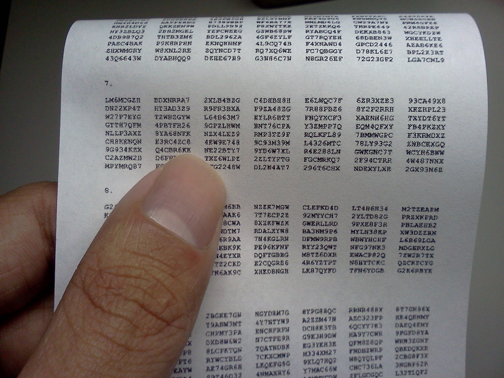
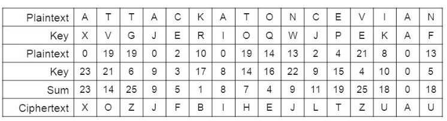
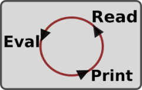
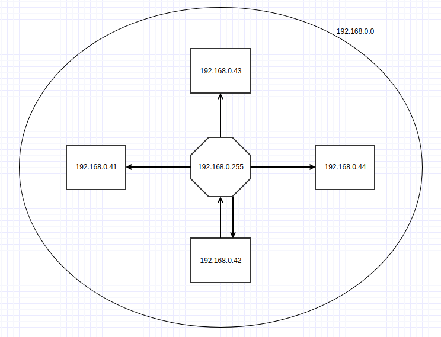
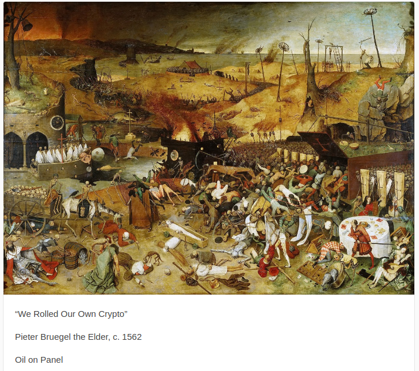
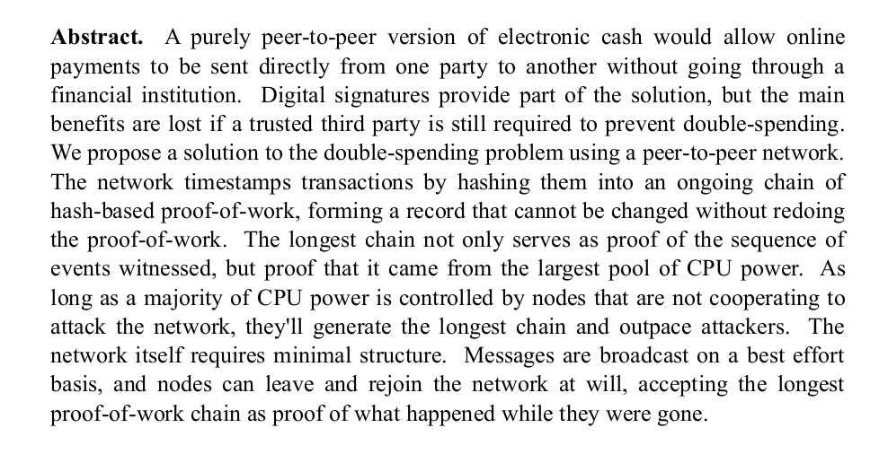
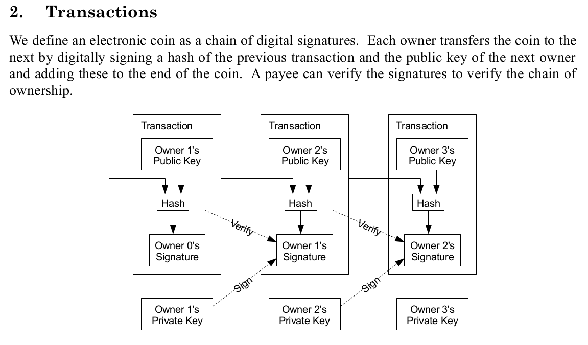
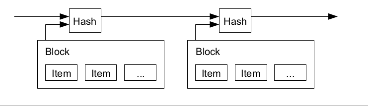

### Crea da zero un clone di Bitcoin

Cosa ci serve?

 - Python 3 installato
 - Il programma "python" eseguibile da terminale ("cmd" su Windows)
 - Un editor di testo per programmatori

<style> .slides:first-child { font-size: 75% !important; } </style>

---

## Benvenuti al workshop!

 > "Ho dovuto scrivere da zero tutto il codice,
 > per convincermi che potevo risolvere ogni problema"

__*L'autore di Bitcoin.*__

<style> .slides:nth-child(2) { background-color: red!important; } </style>

---

## Rigel Di Scala
### Digital Architect <span style="font-size: 25%">Ma che vor di'?</span>


Per contattarmi: https://linkedin.com/in/rigeldiscala

---


---

## Obiettivi del workshop

 - Capire come funziona Blockchain e le criptomonete
 - Creare un piccolo clone di Bitcoin
 - Divertirci

---

## Programma

 - Abbiamo 3 ore e mezza
 - 3 sessioni da un'ora e 3 pause di 10 minuti
 - Le domande sono benvenute in qualsiasi momento

---

## Metodo

 - Python 3 (ovviamente)
 - Scriveremo **tutto** da zero

---

## Cos'è il denaro?

 - una riserva di valore |
 - un mezzo di scambio |
 - un'unità di conto |

---

## ... e il valore del denaro?

 - deriva la sua scarsità? |
 - corrisponde ad un bene materiale? |
 - corrisponde a un debito? |

---

## Domanda

Cosa ci impedisce di creare la nostra moneta personale?

---

 > Dobbiamo risolvere tre problemi fondamentali:
 > 1. Come scambiare informazioni in rete con sconosciuti e in maniera anonima
 > 2. Come creare identità autentiche che possono riscuotere il credito
 > 3. Come inviare informazioni da una identità all'altra, globalmente e in perfetta sicurezza

__*Pieter Hintjens*__, "Hacking the Edges"

---

## Di cosa abbiamo bisogno?

 - Uno o più computer
 - Una rete di comunicazione
 - Un **protocollo** comune
 - ... e forse qualcos'altro...

---

## Atto Primo: la rete peer-to-peer

 > I cypherpunk scrivono il codice. Sappiamo che qualcuno deve creare i software per difendere la privacy, e ... lo stiamo facendo.
 > Il software non può essere distrutto, e un sistema decentralizzato non può essere smantellato.

__*Eric Hughes*__, A Cypherpunk's Manifesto

Note:
 > La privacy è necessaria per una società aperta nell'era digitale. 
 > Non possiamo aspettarci che i governi, le aziende o altre grandi organizzazioni senza volto ci concedano la privacy.
 > Dobbiamo difendere la nostra privacy se ci aspettiamo qualcosa. 
 
 > I cypherpunk scrivono il codice. Sappiamo che qualcuno deve creare i software per difendere la privacy, e ... lo stiamo facendo.
 > Il software non può essere distrutto, e un sistema decentralizzato non può essere smantellato.


---

# Esempi di sistemi decentralizzati che non possono disattivati? 

---

## Radio

 - Informazioni audio trasmesse usando l'energia elettromagnetica
 - Chiunque abbia un sistema radio full-duplex puo ricevere e inviare segnali
 - I tuner radio si sintonizzano sulla banda 3kHz - 300GHz


---

In Italia, la banda cittadina si trova attorno ai 27 mHz, usata principalmente dagli autotrasportatori.


Note:
Cosa succede se ci sintonizziamo su certe frequenze a determinati orari?
---


---
## Stazioni numeriche
### (Number stations)

Usano il sistema crittografico chiamato "Il cifrario di Vernam" o "one time pad", dalla segretezza perfetta.



---



Note:
Le stazioni numeriche sono esempi di reti decentralizzati che usano la crittografia per comunicare in maniera sicura.

---

## Nel nostro caso...

 - Un protocollo (la frequenza, il linguaggio, etc..) |
 - Un client (il sintonizzatore radio) |
 - Un mezzo di trasporto dati, il TCP/IP (l'etere) |

---

## Riscaldamento: il REPL

```
10 READ
20 EVAL
30 PRINT
40 GOTO 10
```



---

`Cos'è Internet? Un mucchio di protocolli!`

__*Pieter Hintjens*__, FOSDEM '13

---

## Il minimo comune protocollo
### REPL
Lo script esegue un loop infinito che chiede input interattivo all'utente, 
nel formato `COMANDO ARGOMENTI`, ad esempio `echo ciao`. L'unico comando supportato e' `echo` che stampa il comando sul terminale.

#### Requisiti

 - Script chiamato "main.py"
 - Invoca `main()` automaticamente
 - Usiamo `input()` per chiedere all'utente di digitare un comando
 - Un unico comando eseguibile `echo`

---

## La rete
### Il broadcasting dei messaggi sulla rete

 - Siamo tutti collegati alla stessa rete
 - Possiamo *broadcastare* messaggi tra di noi
 - Dobbiamo solo accordarci su un protocollo adatto per la comunicazione
---

## Dove mandare i nostri messaggi...

 - Apriamo il terminale
 - Inseriamo:
    `ipconfig` su Windows
    `ifconfig` su Linux/Mac OS

### Esempio
```
inet addr:192.168.0.115  
Bcast:192.168.0.255 
Mask:255.255.255.0
```

---



---

### Server

Usando il netcat tradizionale (non OpenBSD) su Linux: 

```
nc -ulk -p 8000
```

Su OSX:

```
nc -ul 8000
```

### Client

Su Linux:

```
echo "hello" | nc -b -u 192.168.0.255 8000
```
---

## Mille modi per programmare in UDP con Python... e noi useremo...

---

## ASYNCIO
### Segue brevissima introduzione

Note:
Una delle librerie Python più popolari in Sardegna...

---

## Asyncio

 - Il modulo standard in Python 3 per la programmazione asincrona
 - Ruota (*ahah*) attorno al concetto di **event loop**
 - Mettiamo in moto il *loop* e gli diamo compiti ( *task* ) da eseguire
 - Oppure possiamo chiedergli rimanere in ascolto e chiamarci se succede qualcosa di interessante

---
## Asyncio
### Sintassi

```python
import asyncio

async def f():
    await asyncio.sleep(1)
```
```
>>> f
<function foo at 0x7f5509baf9d8>
>>> f()
<coroutine object foo at 0x7f5509bb6ba0>
```

---

## Mostrami il codice!

```python
import asyncio

async def f(uid):
    await asyncio.sleep(uid ** 2)
    print(uid)

loop = asyncio.get_event_loop()
loop.run_until_complete(asyncio.gather(
    f(2),
    f(1)
))
loop.close()
```

---

## Reimplementiamo il nostro REPL usando asyncio

Due coroutine:

 - One for the REPL
 - One for the Network handler

Ricordati: le coroutine sono molto simili ai generatori

---

# Atto secondo: La crittografia asincrona

 > Privacy is the power to selectively reveal oneself to the world

__*Eric Hughes*__, A Cypherpunk's Manifesto

Note:
Conoscete qualche cypherpunk?

---
## Cypherpunk famosi

 - Julian Assange |
 - Bram Cohen |
 - Satoshi Nakamoto? |

---

```
#!/bin/perl -sp0777i<X+d*lMLa^*lN%0]dsXx++lMlN/dsM0<j]dsj
$/=unpack('H*',$_);$_=`echo 16dio\U$k"SK$/SM$n\EsN0p[lN*1
lK[d2%Sa2/d0$^Ixp"|dc`;s/\W//g;$_=pack('H*',/((..)*)$/)
```
__*Adam Back, 1995*___, RSA in tre linee di Perl

---
### Quel piccolo algoritmo... 

 - E-commerce, un giro d'affari da *$1.95 trillioni* di dollari
 - Diventeranno $4 trillioni nel 2020

---
## Concetti base della crittografia asincrona
### Alice e Berto hanno due coppie di chiavi ciascuno
#### Ogni coppia è formata da una chiave pubblica e privata

 - Le pubbliche possono essere condivise con chiunque
 - Le private devono rimanere tali
 - Non è possibile dedurre la chiave privata da quella pubblica

---
## Concetti base (2)

 - Alice cifra il suo messaggio con la sua chiave privata
 - Chiunque abbia la sua chiave pubblica può leggerlo

---

## Concetti base (3)

 - Alice cifra il suo messaggio con la chiave pubblica di Berto
 - Solo Berto può decrittare e leggere il messaggio di Alice

---

## Concetti base (4)

 - Alice vuole dimostrare che un messaggio pubblico proviene veramente da lei
 - Alice ha due possibilità:
    - può crittare il messaggio con la sua chiave privata
    - oppure può crittare il fingerprint del messaggio (firma digitale)

---
### É giunta l'ora di creare il nostro sistema crittografico



---

### Il test di primalità

### L'algoritmo di Euclide (esteso)

Trova il massimo comune divisore (indicato con *MCD*) tra due numeri interi. Nella sua variante estesa, trova i coefficenti dell'identità di Bézout.

### Il reciproco

Quel numero che, moltiplicato per `x`, da come risultato 1.

`8 * X = 1`

---

## Punti chiave (ahah)

 - Qualsiasi numero è fattorizzabile in numeri primi
 - Non si conosco algoritmi efficienti per farlo
 - Più grande è il numero, più difficile è la sua fattorizzazione

---

## Algoritmo RSA triviale e insicuro
### IMPORTANTE: non usare in produzione! :)

 - generiamo una serie di numeri primi |
 - ne scegliamo uno, tale che soddisfi 2 < x < 1000 |
 - implementiamo l'algoritmo di Euclide |
 - implementiamo il reciproco |
 - definiamo P, Q, CONSTANT, MODULUS, PRIVATE_KEY, PUBLIC_KEY |
 - ??? |
 - profit! |

---

# Cifrare e decifrare

---
# Firme digitali

---
# Firmare i nostri messaggi

---
# Visualizzazione a strati del Satoshi client

```
 Validazione delle transazioni, della blockchain e dei peer
                   |
      Engine di scripting / consensus
                   |
             Layer di rete  (codice P2P)
                   |
             Messaggi P2P
```
https://en.bitcoin.it/wiki/Bitcoin_Core_0.11_(ch_1):_Overview

---
# Gli strati semplicati

 - Protocollo
 - Rete
 - Trasporto

---
# Atto 3: Transazioni



 - Cosa non includeremo nel nostro client:
    - input multipli
    - fee di transazione
    - portafogli (wallet)

 - Ma avremo il Coinbase (le ricompense per i minatori) e gli output multipli

---


---
# Atto 4: Il blockchain

---
# I fatidici blocchi

    - Hanno un collegamento al loro antenato
        - Tranne per il Genesis Block
    - Possono contenere una o più transazioni (Coinbase escluso)



---
# Anatomia di un blocco

 - La prima transazione è sempre il Coinbase (la ricompensa) |
 - Seguono tutte le varie transazioni (limite 2MB a blocco) |
 - Domanda: perchè c'è un limite? |

---
# Download iniziale dei blocchi

Quando un nuovo nodo entra a far parte del network, deve immediatamente scaricare una copia complete o parziale del blockchain, e convalidarlo.

---
# Atto finale: il Proof of work

 > La scorta di denaro deve crescere ad una velocità costante.

__*Satoshi Nakamoto*__

Note:
Email e il proof of work

---
## Proof of work

 - Difficile da produrre |
 - Facile da verificare |
 - La quantità di lavoro deve essere modulabile |

---
## La regola n.2 di Bill Booth


 > "Più l'equipaggiamento da paracadutismo diventa sicuro, più rischi vengono presi dai paracadutisti, in modo da mantenere un numero costante di decessi all'anno" 

---
# Consensus

La blockchain piu lunga è quella che ha richiesto più lavoro per produrla, e va considerata come quella canonica.

---
# Domanda finale

### Se controllo il 51% delle risorse totali del network, mi convienere approfittarne per trarne vantaggio in modo illecito (ad esempio cambiando le transazioni passate per spendere la stessa moneta due volte)?